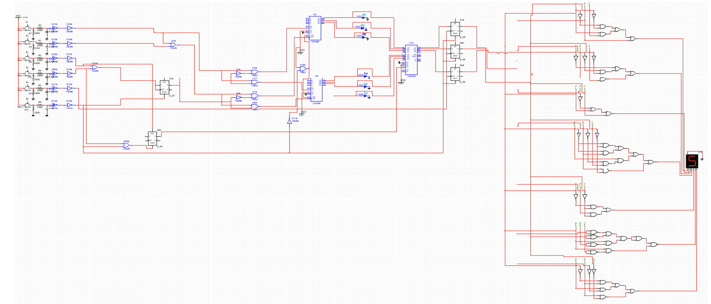

# EE305-logic-calculator

This is a simple MultiSim logic calculator that performs two logic operations, OR and XOR, with two 3-bit numbers using ALU, resistors, capacitors and logic gates. 
The input is two 3-bit binary operands by pressing 0/1 buttons. When we input operands, each operand is displayed on LED as 3-bit binary number. An order of inputs is as follows; first operand, an operator, second operand, and equal (=) button. 
When we press the equal button, the calculated result is displayed on the 7-segment display as 1-digit decimal number. 

